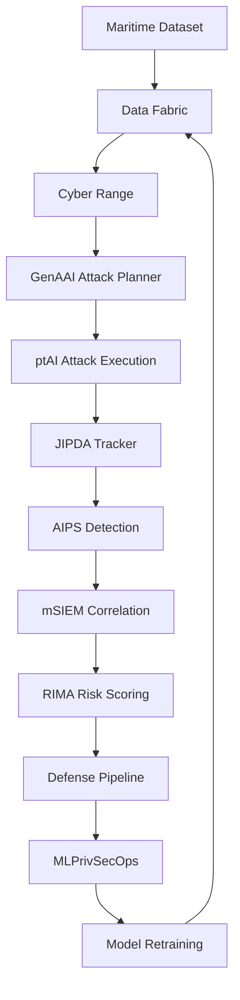

# cPAID Integration Architecture for Maritime Adversarial AI

## Overview

This document maps the maritime adversarial AI research pipeline to the cPAID (Cybersecurity for AI-based Data-driven applications) platform components. The integration enables systematic attack generation, detection, and response within a unified cybersecurity framework.

## cPAID Components

| Component | Full Name | Role in Adversarial AI |
|-----------|-----------|----------------------|
| **GenAAI** | Generative Adversarial AI | Attack planning and generation |
| **ptAI** | Penetration Testing AI | Automated attack execution |
| **AIPS** | AI Intrusion Prevention System | Real-time attack detection |
| **mSIEM** | multi-modal SIEM | Security event correlation |
| **RIMA** | Risk Management AI | Risk scoring and mitigation |
| **Data Fabric** | Knowledge Graph Fabric | Semantic data integration |
| **MLPrivSecOps** | ML Privacy Security Ops | Secure ML lifecycle |
| **Cyber Range** | Isolated Test Environment | Safe attack evaluation |

## Phase-by-Phase Integration

### Phase 1: Reconnaissance & Data Loading

**cPAID Components:** Data Fabric, Cyber Range

**Data Flow:**
```
Maritime Dataset (JSON) 
  → Data Fabric Semantic Lifter
    → Knowledge Graph (entities: sensors, targets, scenarios)
      → Cyber Range (isolated dataset copy)
        → ptAI Reconnaissance Module
```

**API Interface:**
```python
# Data Fabric Connector
class MaritimeDataFabricConnector:
    def lift_to_kg(self, scenario_loader: ScenarioLoader) -> KnowledgeGraph:
        """Lift raw sensor data to semantic knowledge graph."""
        
    def lower_from_kg(self, kg: KnowledgeGraph) -> List[Detection]:
        """Lower KG entities back to detection format."""
```

**Kafka Message Format:**
```json
{
  "topic": "cpaid.datafabric.scenario.loaded",
  "payload": {
    "scenario_id": "scenario2",
    "sensors": ["lidar", "radar", "ir", "eo"],
    "targets": 2,
    "timesteps": 1907,
    "timestamp": "2024-01-15T10:00:00Z"
  }
}
```

### Phase 2a: Camera Attacks (Passive Sensors)

**cPAID Components:** GenAAI, ptAI

**Data Flow:**
```
Camera Detections (bearing measurements)
  → GenAAI Attack Planner
    → Selects attack type (FGSM/PGD/Universal/Backdoor)
      → ptAI Camera Attack Plugin
        → Perturbed Bearings
          → AIPS Detection (optional)
```

**GenAAI Input:**
```json
{
  "target": "camera_sensor",
  "attack_objective": "bearing_manipulation",
  "constraints": {
    "max_perturbation_degrees": 10,
    "stealth_requirement": "high"
  },
  "sensor_profile": {
    "type": "passive",
    "measurement": "bearing_only",
    "detector": "YOLOv4"
  }
}
```

**GenAAI Output:**
```json
{
  "attack_plan": {
    "type": "PGD",
    "epsilon": 0.1,
    "iterations": 10,
    "step_size": 0.02,
    "targeted": false
  },
  "expected_impact": {
    "bearing_shift_degrees": 5.7,
    "track_degradation": 0.3
  }
}
```

**ptAI Plugin Interface:**
```python
class CameraAttackPlugin(ptAI.Plugin):
    def execute(self, attack_plan: Dict, detections: List[Detection]) -> List[Detection]:
        config = CameraAttackConfig(
            attack_type=attack_plan['type'],
            epsilon=attack_plan['epsilon']
        )
        attacker = CameraAdversarialAttacker(config)
        return [attacker.attack(d) for d in detections if d.is_passive]
```

### Phase 2b: Radar/Lidar Attacks (Active Sensors)

**cPAID Components:** GenAAI, ptAI, Cyber Range

**Data Flow:**
```
Point Cloud Data (N, E, D)
  → GenAAI Attack Planner
    → Selects attack type (cluster_split/merge/ghost/suppression)
      → ptAI PointCloud Attack Plugin
        → Perturbed Point Cloud
          → Cyber Range (safe evaluation)
```

**GenAAI Input:**
```json
{
  "target": "lidar_radar_sensors",
  "attack_objective": "cluster_manipulation",
  "constraints": {
    "max_points_injected": 20,
    "clustering_threshold": 5.0,
    "stealth_requirement": "medium"
  },
  "sensor_profile": {
    "type": "active",
    "measurement": "point_cloud",
    "clustering": "single_link_hierarchical"
  }
}
```

**ptAI Plugin Interface:**
```python
class PointCloudAttackPlugin(ptAI.Plugin):
    def execute(self, attack_plan: Dict, detections: List[Detection]) -> List[Detection]:
        config = PointCloudAttackConfig(
            attack_type=attack_plan['type'],
            epsilon=attack_plan['epsilon'],
            num_ghost_points=attack_plan.get('num_ghost_points', 10)
        )
        attacker = PointCloudAttacker(config)
        return [attacker.attack(d) for d in detections if d.is_active]
```

### Phase 2c: Fusion Attacks (JIPDA Tracker)

**cPAID Components:** GenAAI, ptAI, AIPS

**Data Flow:**
```
Multi-sensor Detections
  → GenAAI Fusion Attack Planner
    → Selects attack type (existence_suppression/false_track/association_confusion)
      → ptAI Fusion Attack Plugin
        → Perturbed Detections
          → JIPDA Tracker
            → AIPS Anomaly Detection
```

**GenAAI Input:**
```json
{
  "target": "jipda_fusion_tracker",
  "attack_objective": "track_manipulation",
  "constraints": {
    "max_tracks_affected": 2,
    "duration_seconds": 5.0,
    "cross_sensor_coordination": true
  },
  "tracker_profile": {
    "type": "JIPDA",
    "existence_threshold": 0.8,
    "gate_threshold": 9.21,
    "sensors": [1, 2, 3, 4]
  }
}
```

### Phase 3: Physical Realizability (EOT)

**cPAID Components:** Cyber Range, RIMA

**Data Flow:**
```
Digital Adversarial Perturbations
  → Cyber Range Physical Simulator
    → Maritime Environment Model (waves, weather, lighting)
      → EOT Transform (Expected Over Transformation)
        → RIMA Risk Assessment
          → Physical Attack Feasibility Score
```

**EOT Integration:**
```python
class MaritimeEOT:
    """Expected Over Transformation for maritime environment."""
    
    def __init__(self, cyber_range: CyberRange):
        self.wave_model = cyber_range.get_wave_model()
        self.weather_model = cyber_range.get_weather_model()
        
    def transform(self, perturbation: np.ndarray, 
                  scene_params: Dict) -> np.ndarray:
        """Apply maritime transformations to perturbation."""
        # Wave-induced camera motion
        # Rain/fog attenuation for lidar
        # Sea clutter for radar
        pass
```

### Phase 4: Evaluation

**cPAID Components:** mSIEM, RIMA, Data Fabric

**Data Flow:**
```
Benign vs Attacked Results
  → Evaluation Metrics Module
    → mSIEM Event Correlation
      → RIMA Risk Scoring
        → Data Fabric (results storage)
```

**mSIEM Alert Format:**
```json
{
  "topic": "cpaid.msiem.attack.detected",
  "severity": "high",
  "payload": {
    "attack_type": "cluster_split",
    "target_sensor": "lidar",
    "metrics": {
      "rmse_increase": 15.3,
      "detection_probability_drop": 0.25,
      "track_loss": 1
    },
    "timestamp": "2024-01-15T10:05:00Z"
  }
}
```

**RIMA Risk Score Calculation:**
```python
class MaritimeRiskScorer(RIMA.RiskScorer):
    def calculate(self, metrics: DetectionMetrics) -> RiskScore:
        """Calculate risk score from attack impact metrics."""
        components = {
            'detection_degradation': metrics.detection_probability_drop * 0.3,
            'position_accuracy': min(metrics.rmse_increase / 50, 1.0) * 0.3,
            'track_integrity': metrics.track_loss * 0.2,
            'false_alarm_increase': metrics.far_increase * 0.2
        }
        return RiskScore(
            total=sum(components.values()),
            components=components,
            severity=self._classify(sum(components.values()))
        )
```

### Phase 5: Defenses

**cPAID Components:** AIPS, MLPrivSecOps

**Data Flow:**
```
Attacked Detections
  → AIPS Input Sanitization
    → Multi-sensor Agreement Check
      → Anomaly Detection (Isolation Forest)
        → Robust Clustering
          → Clean Detections
            → MLPrivSecOps (model retraining trigger)
```

**AIPS Defense Pipeline:**
```python
class AIPSDefensePipeline:
    """AIPS-compatible defense pipeline."""
    
    def __init__(self, config: DefenseConfig):
        self.sanitizer = InputSanitizer(config)
        self.agreement = MultiSensorAgreement(config)
        self.anomaly = AnomalyDetector(config)
        self.clustering = RobustClustering(config)
    
    def process(self, detections: List[Detection]) -> Tuple[List[Detection], List[Alert]]:
        """Process detections and return cleaned data + alerts."""
        alerts = []
        
        # Step 1: Input sanitization
        clean, sanitization_alerts = self.sanitizer.clean(detections)
        alerts.extend(sanitization_alerts)
        
        # Step 2: Multi-sensor agreement
        consistent, agreement_alerts = self.agreement.check(clean)
        alerts.extend(agreement_alerts)
        
        # Step 3: Anomaly detection
        normal, anomaly_alerts = self.anomaly.detect(consistent)
        alerts.extend(anomaly_alerts)
        
        # Step 4: Robust clustering
        final = self.clustering.cluster(normal)
        
        return final, alerts
```

**MLPrivSecOps Integration:**
```python
class MLPrivSecOpsTrigger:
    """Trigger model retraining based on attack detection."""
    
    def on_attack_detected(self, alert: Alert):
        if alert.severity == 'critical':
            # Trigger model retraining
            self.trigger_retraining(
                dataset=self.get_attacked_dataset(),
                defense_augmentation=True
            )
        
        # Update threat model
        self.update_threat_model(
            attack_vector=alert.attack_type,
            mitigation=alert.defense_applied
        )
```

## End-to-End Data Flow



## API Gateway Specification

### REST Endpoints

```
POST /api/v1/scenario/load
  → Load scenario data into Cyber Range

POST /api/v1/attack/plan
  → GenAAI generates attack plan

POST /api/v1/attack/execute
  → ptAI executes attack

GET /api/v1/attack/results
  → Retrieve attack evaluation metrics

POST /api/v1/defense/apply
  → Apply defense pipeline

GET /api/v1/risk/score
  → Get RIMA risk assessment
```

### Kafka Topics

```
cpaid.datafabric.scenario.loaded
cpaid.genai.attack.planned
cpaid.ptai.attack.executed
cpaid.aips.anomaly.detected
cpaid.msiem.alert.correlated
cpaid.rima.risk.scored
cpaid.defense.applied
cpaid.mlops.model.retrained
```

## Implementation Status

| Phase | Component | Status | File |
|-------|-----------|--------|------|
| 1 | Data Loader | ✅ Complete | `src/data_loader.py` |
| 1 | Visualization | ✅ Complete | `src/visualization/plot_utils.py` |
| 2a | Camera Attacks | ✅ Complete | `src/attacks/camera_attacks.py` |
| 2b | Radar/Lidar Attacks | ✅ Complete | `src/attacks/radar_lidar_attacks.py` |
| 2c | Fusion Attacks | ✅ Complete | `src/attacks/fusion_attacks.py` |
| 3 | Physical EOT | 🔄 Pending | `src/attacks/physical_eot.py` |
| 4 | Evaluation | ✅ Complete | `src/evaluation/metrics.py` |
| 5 | Defenses | ✅ Complete | `src/defenses/defense_mechanisms.py` |
| - | Pipeline | ✅ Complete | `src/pipeline.py` |
| - | cPAID Mapping | ✅ Complete | `docs/cpaid_mapping.md` |

## Next Steps

1. **Implement Physical EOT Module**: Add wave, weather, and lighting transformations
2. **Create ptAI Plugin Wrappers**: Wrap attack classes as ptAI plugins
3. **Implement Data Fabric Connector**: Semantic lifting/lowering for maritime data
4. **Generate AIPS Alert Messages**: Kafka producer for anomaly alerts
5. **Implement RIMA Risk Scorer**: Quantitative risk assessment
6. **Test Full Pipeline**: Run across all 9 scenarios
7. **Create Visualization Dashboard**: Attack results vs benign baseline
